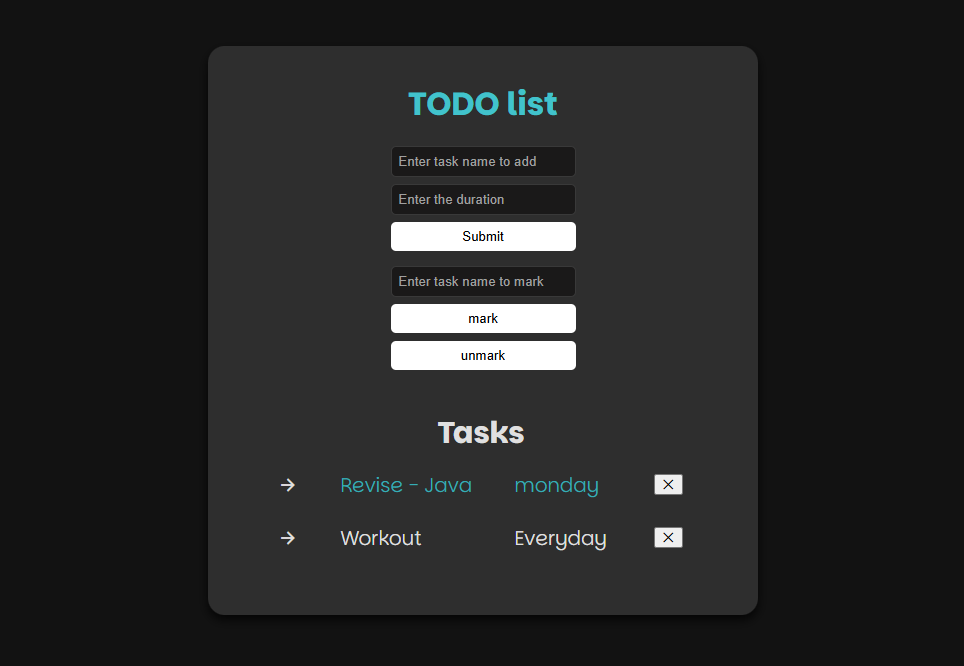

# ✅ Todo List

A simple **Todo List** built using **HTML, CSS, and JavaScript**, allowing users to add, remove and mark tasks if required. 

## 🌍 Live Demo  
[Click here to view the project](https://sepuripavan.github.io/Todo-list/)

## 🛠 Tech Stack  
- **HTML** – For structuring the webpage  
- **CSS** – For styling and responsiveness  
- **JavaScript** – For adding interactivity  

## 📸 Screenshot  
  

## 🚀 Run Locally  
1.  Clone the project
```bash
git clone https://link-to-project   
```
2.  Go to the project directory
```bash
cd todo-list
```
